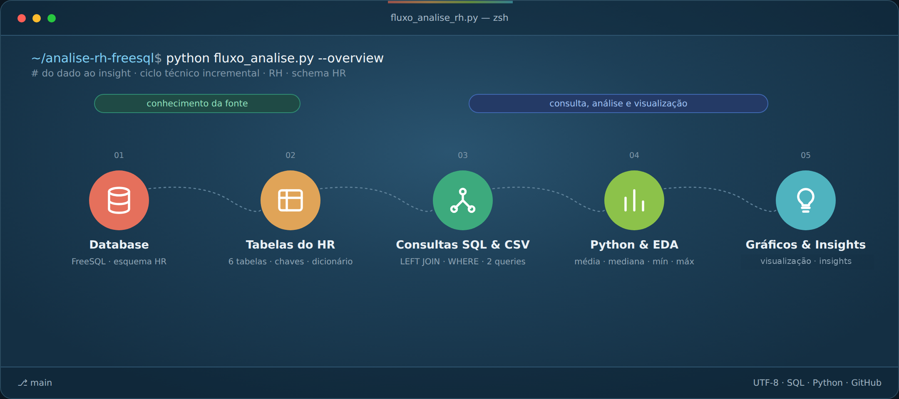
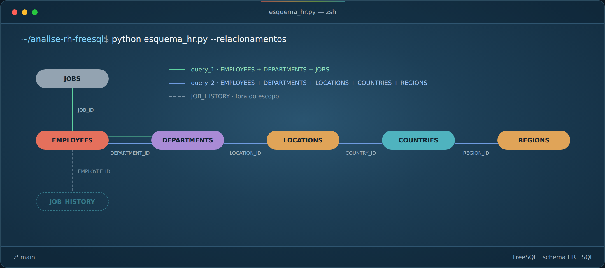
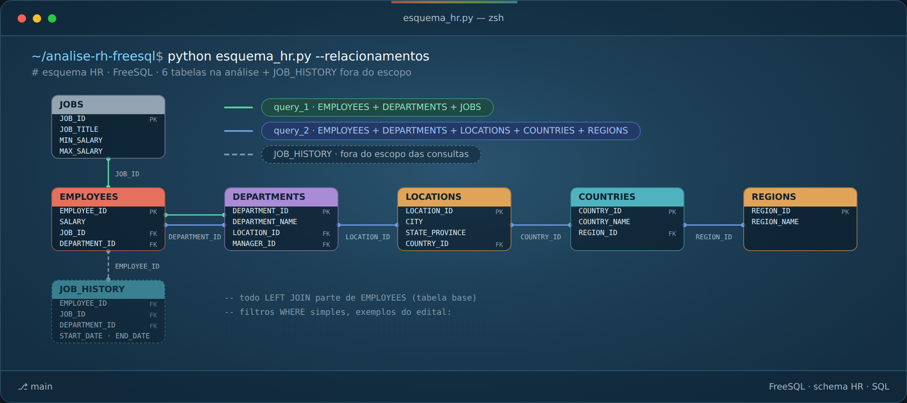

# Projeto Avaliativo RH — Análise Exploratória de Dados

**Maria Laura Correa da Silva · T3 · Visualização de Dados e Business Intelligence**



> Análise exploratória da base **Human Resources (HR)**, utilizando SQL para extração e relacionamento dos dados e Python para análise e visualização.

---

## 🧭 Navegação

| | |
|---|---|
| [🎯 Objetivo](#-objetivo) | [🗂️ Dados e consultas](#️-dados-e-consultas) |
| [🔗 Consultas SQL](#-consultas-sql) | [📊 Análise exploratória](#-análise-exploratória) |
| [💡 Insights](#-insights) | [⚠️ Limitações](#️-limitações) |
| [🚀 Sugestões de melhoria](#-sugestões-de-melhoria) | [🛠️ Tecnologias](#️-tecnologias) |
| [📁 Estrutura](#-estrutura-do-projeto) | [▶️ Execução](#️-como-executar) |
| [🎥 Vídeo](#-vídeo) | [🌿 Versionamento](#-versionamento) |

---

## 🎯 Objetivo

Explorar dados de Recursos Humanos para compreender a distribuição dos salários sob diferentes perspectivas — **cargo, departamento e região**.

O projeto combina:

- relacionamento e filtragem de dados com **SQL**;
- análise exploratória com **Python**;
- estatística descritiva;
- visualização de padrões;
- interpretação dos resultados com uma perspectiva de **impacto**.

A proposta não é apenas apresentar números, mas transformar os dados em perguntas e evidências que apoiem uma leitura mais contextualizada do cenário analisado.

[⬆️ Voltar à navegação](#-navegação)

---

## 🗂️ Dados e consultas

A análise utiliza o esquema **Human Resources (HR)** disponibilizado pelo FreeSQL.

### Tabelas utilizadas

| Tabela | Função na análise |
|---|---|
| `HR.EMPLOYEES` | Funcionários, salários e cargos |
| `HR.DEPARTMENTS` | Departamentos |
| `HR.JOBS` | Informações dos cargos |
| `HR.LOCATIONS` | Localização dos departamentos |
| `HR.COUNTRIES` | Países |
| `HR.REGIONS` | Regiões geográficas |

A tabela `JOB_HISTORY` foi reconhecida no esquema, mas ficou **fora do escopo desta análise**.

### Escopo do relacionamento



O relacionamento dos dados permite sair do registro individual do funcionário e chegar às dimensões organizacionais e geográficas utilizadas nas perguntas analíticas.

[⬆️ Voltar à navegação](#-navegação)

---

## 🔗 Consultas SQL

Foram desenvolvidas duas consultas principais para gerar as bases utilizadas na análise em Python.

| Consulta | Pergunta analítica | Relacionamentos |
|---|---|---|
| `query_1.sql` | Como os salários se distribuem por departamento e cargo? | `EMPLOYEES` → `DEPARTMENTS` → `JOBS` |
| `query_2.sql` | Como os salários se distribuem entre regiões? | `EMPLOYEES` → `DEPARTMENTS` → `LOCATIONS` → `COUNTRIES` → `REGIONS` |

### Query 1 — Departamento e cargo

Utiliza `EMPLOYEES`, `DEPARTMENTS` e `JOBS`, com **dois `LEFT JOIN`** e filtro para considerar registros com salário informado:

```sql
WHERE e.salary IS NOT NULL
```

Resultado exportado para:

`data/query_01.csv`

### Query 2 — Região

Relaciona `EMPLOYEES` até `REGIONS`, utilizando múltiplos `LEFT JOIN` para construir a dimensão geográfica.

Também considera apenas registros com salário informado:

```sql
WHERE e.salary IS NOT NULL
```

Resultado exportado para:

`data/query_02.csv`

### Consultas auxiliares

Também foram utilizados arquivos para reconhecimento das restrições e dos dados:

- `sql/query_1_reconhecimento_constraints.sql`
- `sql/query_2_reconhecimento_dados.sql`



[⬆️ Voltar à navegação](#-navegação)

---

## 📊 Análise exploratória

A etapa de análise foi realizada no notebook:

`notebooks/analise_rh.ipynb`

Foram explorados:

- estrutura e dimensões das bases;
- tipos de dados;
- primeiras linhas;
- valores ausentes;
- registros duplicados;
- estatísticas descritivas;
- média, mediana, mínimo, máximo, quartis e desvio-padrão;
- distribuição dos salários;
- médias salariais por cargo e departamento;
- distribuição regional dos salários.

### Visualizações

A análise utiliza **Matplotlib** e **Seaborn** para construir diferentes perspectivas sobre os dados:

- histograma da distribuição salarial;
- média salarial por cargo;
- média salarial por departamento;
- boxplot da distribuição salarial por região.

A combinação dessas visualizações permite observar tanto valores centrais quanto dispersão, concentração e possíveis valores extremos.

[⬆️ Voltar à navegação](#-navegação)

---

## 💡 Insights

### Visão geral

- **107 funcionários** possuem salário informado.
- **Média salarial:** R$ 6.461,83.
- **Mediana:** R$ 6.200,00.
- **Maior salário:** R$ 24.000,00.

### Distribuição regional

| Região | Funcionários | Média salarial | Mediana |
|---|---:|---:|---:|
| Europe | 36 | R$ 8.916,67 | R$ 8.900,00 |
| Americas | 70 | R$ 5.191,66 | R$ 3.300,00 |
| Sem informação geográfica | 1 | — | — |

### Principal insight

A **média salarial, isoladamente, não é suficiente para compreender a distribuição dos salários**.

Ao comparar média, mediana, quantidade de registros e dispersão, percebe-se que grupos diferentes podem apresentar comportamentos bastante distintos. Por isso, a leitura dos dados precisa considerar o contexto de cada recorte analisado.

Essa é uma das principais contribuições da análise exploratória: **identificar padrões que ajudam a formular novas perguntas**, sem transformar associação em causalidade.

[⬆️ Voltar à navegação](#-navegação)

---

## ⚠️ Limitações

Os resultados devem ser interpretados considerando o escopo da base e da análise:

- trata-se de uma análise **descritiva**, sem inferência causal;
- alguns grupos possuem poucos registros;
- existe um registro sem informação geográfica;
- outras variáveis potencialmente explicativas não foram incorporadas;
- diferenças observadas entre grupos não permitem, por si só, explicar suas causas.

[⬆️ Voltar à navegação](#-navegação)

---

## 🚀 Sugestões de melhoria

Em uma evolução do projeto, seria possível:

- incorporar outras dimensões organizacionais e variáveis disponíveis;
- aprofundar a investigação das diferenças salariais entre grupos;
- ampliar as visualizações conforme novas perguntas analíticas;
- combinar a base com outras fontes de dados, quando pertinente.

A evolução deve partir de **perguntas analíticas claras**, e não apenas do aumento da complexidade técnica.

[⬆️ Voltar à navegação](#-navegação)

---

## 🛠️ Tecnologias

- **SQL** — extração, relacionamento e filtragem dos dados
- **Python** — análise exploratória
- **Pandas** — manipulação dos dados
- **NumPy** — operações numéricas
- **Matplotlib** — visualização
- **Seaborn** — visualização estatística
- **Jupyter Notebook** — documentação da análise
- **Git/GitHub** — versionamento e organização do projeto

[⬆️ Voltar à navegação](#-navegação)

---

## 📁 Estrutura do projeto

```text
.
├── data/
│   ├── query_01.csv
│   └── query_02.csv
│
├── imagens/
│   ├── fluxo_analise_rh_geral.png
│   ├── schema_hr_escopo.png
│   └── schema_tecnico_rh.png
│
├── notebooks/
│   └── analise_rh.ipynb
│
├── sql/
│   ├── query_1.sql
│   ├── query_2.sql
│   ├── query_1_reconhecimento_constraints.sql
│   └── query_2_reconhecimento_dados.sql
│
├── .gitignore
└── README.md
```

[⬆️ Voltar à navegação](#-navegação)

---

## ▶️ Como executar

### Pré-requisitos

- Python 3.x
- Jupyter Notebook ou JupyterLab
- Bibliotecas:
  - `pandas`
  - `numpy`
  - `matplotlib`
  - `seaborn`

### Execução

1. Clone o repositório.
2. Instale as dependências necessárias.
3. Execute as consultas SQL para obter os arquivos `.csv`.
4. Abra `notebooks/analise_rh.ipynb`.
5. Execute as células do notebook na sequência apresentada.

Os arquivos CSV utilizados na análise estão na pasta `data/`.

[⬆️ Voltar à navegação](#-navegação)

---

## 🌿 Versionamento

O desenvolvimento foi organizado em branch de trabalho, com integração posterior ao fluxo principal do projeto.

O versionamento registra a evolução da análise, dos arquivos SQL, do notebook e da documentação.

[⬆️ Voltar à navegação](#-navegação)

---

## 🎥 Vídeo

A apresentação em vídeo percorre a construção do projeto, desde o reconhecimento da fonte de dados até a interpretação dos resultados.

O roteiro contempla:

**fonte e estrutura dos dados → SQL → filtros e seus efeitos → análise exploratória em Python → visualizações → principal insight → limitações → perspectiva de impacto.**

**Link:** [INSERIR LINK APÓS A GRAVAÇÃO]

[⬆️ Voltar à navegação](#-navegação)

---

## 📌 Encerramento

Este projeto representa uma jornada de **extração → organização → exploração → visualização → interpretação**.

Mais do que apresentar resultados, a análise busca mostrar como os dados podem ser utilizados para **enxergar padrões, formular perguntas e orientar investigações futuras**.

---
