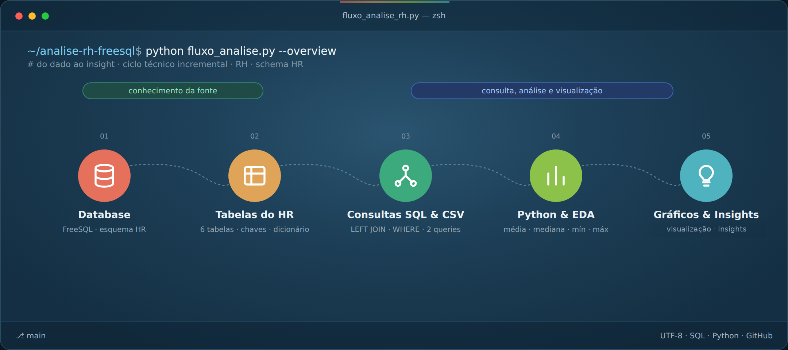
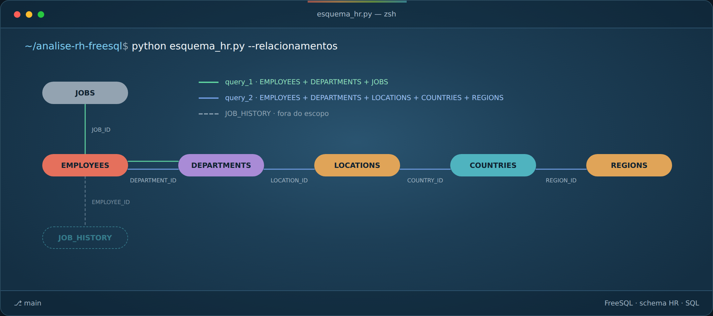
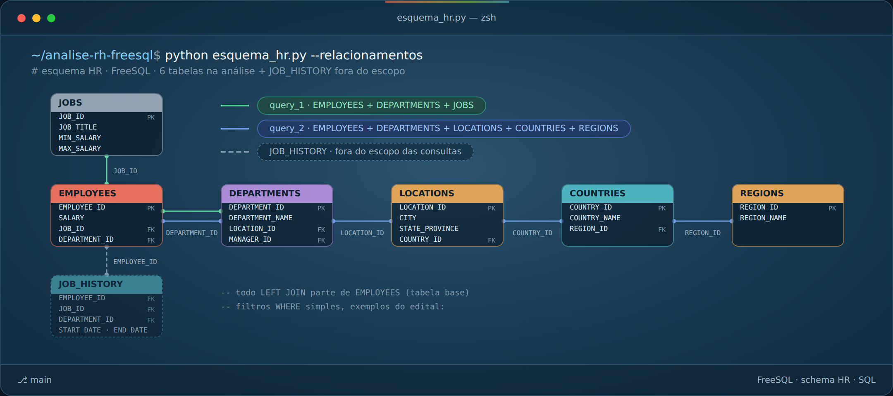

# Projeto Avaliativo RH — Análise Exploratória de Dados

**Maria Laura Correa da Silva · T3 · Visualização de Dados e Business Intelligence**



---

## 📌 Navegação

- [Objetivo](#-objetivo)
- [Dados](#-dados)
- [Consultas SQL](#-consultas-sql)
- [Análise](#-análise)
- [Resultados](#-resultados)
- [Limitações](#-limitações)
- [Sugestões de melhoria](#-sugestões-de-melhoria)
- [Tecnologias e ferramentas](#️-tecnologias-e-ferramentas)
- [Estrutura](#-estrutura)
- [Como executar](#-como-executar)
- [Versionamento](#-versionamento)
- [Vídeo](#-vídeo)
- [Licença](#-licença)

---

## 🎯 Objetivo

Analisar a distribuição dos salários da base **Human Resources (HR)** considerando cargo, departamento e região.

O projeto utiliza **SQL** para extração e relacionamento dos dados e **Python** para análise exploratória, estatística descritiva e visualização.

A análise é descritiva e não estabelece relações de causa e efeito.

---

## 🗂️ Dados

A análise utiliza o esquema **Human Resources (HR)** disponibilizado pelo [FreeSQL](https://freesql.com/).

| Tabela | Conteúdo |
|---|---|
| `HR.EMPLOYEES` | Funcionários, salários e cargos |
| `HR.DEPARTMENTS` | Departamentos |
| `HR.JOBS` | Cargos |
| `HR.LOCATIONS` | Localização |
| `HR.COUNTRIES` | Países |
| `HR.REGIONS` | Regiões |

A tabela `JOB_HISTORY` foi reconhecida durante a exploração do esquema, mas ficou fora do escopo da análise.



---

## 🔎 Consultas SQL

### Query 1 — Salários por departamento e cargo

Relacionamento:

`EMPLOYEES → DEPARTMENTS → JOBS`

A consulta utiliza `LEFT JOIN` e considera apenas funcionários com salário informado.

- Consulta: [`sql/query_1.sql`](sql/query_1.sql)
- Resultado: [`data/query_01.csv`](data/query_01.csv)

### Query 2 — Funcionários e salários por região

Relacionamento:

`EMPLOYEES → DEPARTMENTS → LOCATIONS → COUNTRIES → REGIONS`

A consulta utiliza `LEFT JOIN` e considera apenas funcionários com salário informado.

- Consulta: [`sql/query_2.sql`](sql/query_2.sql)
- Resultado: [`data/query_02.csv`](data/query_02.csv)

### Consultas auxiliares

Utilizadas durante o reconhecimento das restrições e dos dados:

- [`sql/query_1_reconhecimento_constraints.sql`](sql/query_1_reconhecimento_constraints.sql)
- [`sql/query_2_reconhecimento_dados.sql`](sql/query_2_reconhecimento_dados.sql)



---

## 📊 Análise

Os arquivos CSV foram analisados no notebook [`notebooks/analise_rh.ipynb`](notebooks/analise_rh.ipynb).

A análise exploratória contempla:

- estrutura e dimensões dos dados;
- tipos das variáveis;
- registros iniciais;
- valores ausentes e duplicidades;
- média, mediana, mínimo e máximo;
- quartis e desvio-padrão;
- distribuição dos salários.

### Visualizações

Foram produzidas visualizações da:

- distribuição dos salários;
- média salarial por cargo;
- média salarial por departamento;
- distribuição salarial por região.


---

## 📈 Resultados

### Salários

- **107** funcionários com salário informado;
- média: **R$ 6.461,83**;
- mediana: **R$ 6.200,00**;
- máximo: **R$ 24.000,00**.

### Média salarial por departamento

| Departamento | Média salarial |
|---|---:|
| Executive | R$ 19.333 |
| Accounting | R$ 10.154 |
| Public Relations | R$ 10.000 |
| Marketing | R$ 9.500 |
| Sales | R$ 8.956 |
| Finance | R$ 8.601 |
| Human Resources | R$ 6.500 |
| IT | R$ 5.760 |
| Administration | R$ 4.400 |
| Purchasing | R$ 4.150 |
| Shipping | R$ 3.476 |

> O tamanho de cada grupo deve ser considerado na interpretação das médias.

### Distribuição por região

| Região | Registros | Média | Mediana |
|---|---:|---:|---:|
| Europe | 36 | R$ 8.916,67 | R$ 8.900,00 |
| Americas | 70 | R$ 5.191,67 | R$ 3.300,00 |
| Sem informação geográfica | 1 | — | — |

### Insight

A média salarial, isoladamente, não explica a distribuição dos salários.

A comparação entre **média e mediana**, junto da dispersão e dos valores extremos, mostra por que diferentes medidas precisam ser observadas em conjunto.

---

## ⚠️ Limitações

- A análise é descritiva e não estabelece causalidade.
- Alguns grupos possuem poucos registros.
- Um registro não possui informação geográfica.
- Outras variáveis que poderiam contribuir para explicar diferenças salariais não foram analisadas.

---

## 💡 Sugestões de melhoria

- Incorporar outras variáveis disponíveis na base.
- Aprofundar a análise das diferenças salariais.
- Utilizar outras fontes de dados quando uma questão analítica justificar a combinação.
- Ampliar as visualizações conforme novas perguntas forem identificadas.

---

## 🛠️ Tecnologias e ferramentas

### Análise e desenvolvimento

- SQL
- Python
- Pandas
- NumPy
- Matplotlib
- Seaborn
- Jupyter Notebook
- [FreeSQL](https://freesql.com/)
- Git / GitHub

### Produção

- Microsoft Clipchamp

### IA generativa

O desenvolvimento do código contou com o **ChatGPT (OpenAI)** como apoio à programação, depuração, revisão e organização do código.

As análises, consultas e resultados foram executados e validados pela autora. A IA foi utilizada como apoio ao desenvolvimento, não como substituta da análise ou da validação dos resultados.

---

## 📁 Estrutura

```text
07_Projeto_Avaliativo_MariaLauraCorreaDaSilva_T3/
│
├── data/
│   ├── query_01.csv
│   └── query_02.csv
│
├── imagens/
│   ├── fluxo_analise_rh_geral.png
│   ├── schema_hr_escopo.png
│   ├── schema_tecnico_rh.png
│   └── distribuicao_salarios.png
│
├── notebooks/
│   └── analise_rh.ipynb
│
├── sql/
│   ├── query_1.sql
│   ├── query_2.sql
│   ├── query_1_reconhecimento_constraints.sql
│   └── query_2_reconhecimento_dados.sql
│
├── video/
│   ├── Blocos_1_8/
│   └── Projeto_RH_VIDEO_FINAL_leve.mp4
│
├── .gitignore
├── LICENSE
└── README.md
```

---

## ▶️ Como executar

### Pré-requisitos

- Python 3.x
- Jupyter Notebook ou JupyterLab
- Git

### Ambiente virtual

```bash
python -m venv .venv
```

No Windows:

```bash
.venv\Scripts\activate
```

### Instalação

```bash
pip install pandas numpy matplotlib seaborn jupyter
```

### Executar o notebook

```bash
jupyter notebook
```

Abra:

```text
notebooks/analise_rh.ipynb
```

Os arquivos `query_01.csv` e `query_02.csv` devem estar no diretório `data/`.

---

## 🌿 Versionamento

O projeto foi desenvolvido em branches de trabalho, com commits separados por etapas e funcionalidades.

A etapa de análise e documentação está na branch `feature/analise`, com integração posterior ao fluxo principal do projeto.

---

## 🎥 Vídeo

Vídeo final da apresentação e demonstração do projeto:

**[▶️ Assistir ao vídeo — Google Drive](https://drive.google.com/file/d/1wE9nMzrCdw5pySrF7aMl2QJy4yGQgXpE/view?usp=sharing)**

---

## 📄 Licença

Este projeto está licenciado sob a **MIT License**.

Consulte o arquivo [`LICENSE`](LICENSE) para os termos completos.
